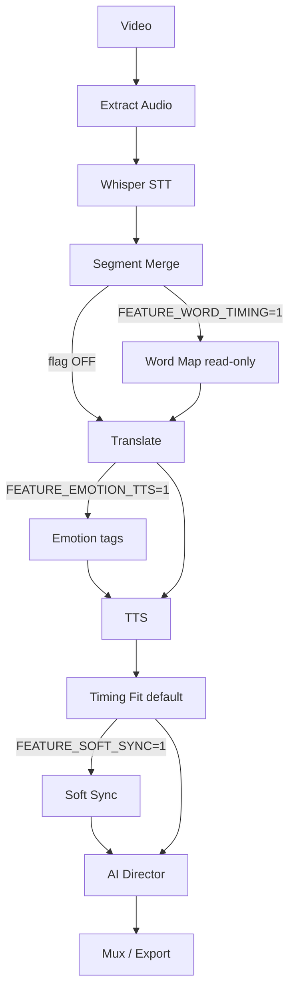

# TUBEDUB 2.0 — Отчёт реализации Phase 1

**Дата:** 2026-06-23  
**Проект:** VideoMonster_V2 / TubeDub  
**Принцип:** EXTEND, не rewrite. Default pipeline без flags = прежний behavior.

---

## 1. Изменённые файлы

| Файл | Изменение |
|------|-----------|
| `api/auto_dub_api.py` | Word timing за `FEATURE_WORD_TIMING`; emotion pre-TTS; AI Director после timing |
| `engines/timing_fit.py` | Опциональный путь Soft Sync при `FEATURE_SOFT_SYNC` |
| `engines/tts.py` | Emotion rate/pitch при `FEATURE_EMOTION_TTS` |
| `engines/app_loader.py` | Регистрация dev_api, assistant_api, recording_api |
| `app.py` | Route `/dev/pipeline/<task_id>`, dev_pipeline.html, API skip prefixes |
| `api/studio_api.py` | Stubs mute/solo/volume для timeline |
| `templates/studio.html` | Контейнер timeline + studio_timeline.js |
| `data/feature_flags.json` | soft_sync, emotion_tts, ai_director, ai_assistant, user_recording |

---

## 2. Новые файлы

### Core (`engines/core/`)
- `feature_flags.py` — VM_DEV_MODE, is_module_visible
- `module_registry.py` — GREEN/YELLOW/RED
- `pipeline_contracts.py` — WordTiming, SegmentTiming, PipelineContext
- `events.py` — event bus
- `__init__.py`

### Pipeline modules
- `engines/word_timing.py` — facade WordTimingMap
- `engines/soft_sync.py` — hard anchor + soft stretch
- `engines/emotion_tagger.py` — heuristic emotions → TTS params
- `engines/ai_director.py` — QualityScore, block_export, issues

### Plugins & project
- `engines/plugins/base.py`, `registry.py`, `__init__.py`
- `engines/project_format.py` — .tdproj zip + autosave hook

### Cloud / Live interfaces
- `engines/cloud/storage_interface.py`
- `engines/live/live_interface.py`

### API
- `api/dev_api.py`
- `api/assistant_api.py`
- `api/recording_api.py`

### UI
- `templates/dev_pipeline.html`
- `static/js/dev_pipeline.js`
- `static/js/studio_timeline.js`

### Tests & docs
- `tests/test_feature_flags.py`
- `tests/test_word_timing.py`
- `tests/test_ai_director.py`
- `docs/TUBEDUB_2_ARCHITECTURE.md`
- `TUBEDUB_2_IMPLEMENTATION_REPORT.md` (этот файл)

---

## 3. Структура модулей

```
engines/
  core/           # NEW — contracts, flags bridge, events
  word_timing.py  # NEW — facade → word_timing_map/
  soft_sync.py    # NEW
  emotion_tagger.py
  ai_director.py
  plugins/        # NEW
  project_format.py
  cloud/storage_interface.py
  live/live_interface.py
  word_timing_map/  # EXISTING — не переписан
  tubedub/          # EXISTING — project, plugins host
api/
  dev_api.py
  assistant_api.py
  recording_api.py
```

---

## 4. Pipeline diagram



---

## 5. API (developer)

| Метод | Путь | Описание |
|-------|------|----------|
| GET | `/api/dev/pipeline/<task_id>` | Стадии, word map, director, events |
| GET | `/api/dev/pipeline/<task_id>/report` | Полный текст отчёта + copy |
| GET | `/api/dev/modules/readiness` | GREEN/YELLOW/RED таблица |
| GET | `/api/dev/events` | Event bus history |
| POST | `/api/assistant/command` | shorter, conversational, formal, polish |
| GET | `/api/assistant/commands` | Список команд |
| POST | `/api/recording/punch-in` | Stub YELLOW |
| POST | `/api/recording/punch-out` | Stub YELLOW |
| GET | `/api/studio/tracks` | Track state |
| POST | `/api/studio/track/<id>/state` | mute/solo/volume |

UI: `/dev/pipeline` и `/dev/pipeline/<task_id>` — не в user sidebar без dev.

---

## 6. GREEN vs RED (честный статус)

### GREEN (stable / production path)
- Core dubbing (`/dub`, auto_dub_api default)
- Translation, TTS, timing_fit default
- Studio text workflow (без timeline)
- License, owner, voice flows
- LocalStorage cloud interface

### YELLOW (beta / partial)
- Word Timing Map (`FEATURE_WORD_TIMING`, experimental)
- User Recording API stub
- Dub Studio module registry status beta/development

### RED (skeleton / NOT production)
- **Dub Studio DAW timeline** — UI skeleton only (`studio_timeline.js`)
- **Live** (`live_interface.py` — RED)
- **Google Drive / S3** storage stubs
- **AI Assistant** — command map only, no chat LLM
- **Plugins EQ/Compressor** — pass-through with logging
- **AI Director** — heuristic checklist, не ML validation

---

## 7. Ограничения Phase 1

1. Полный DAW Dub Studio **не реализован** — только skeleton + API stubs (RED).
2. Word timing **не влияет** на default pipeline без `FEATURE_WORD_TIMING=1`.
3. Soft sync **не активен** без `FEATURE_SOFT_SYNC=1`.
4. Emotion TTS — rule-based, не acoustic emotion detection.
5. AI Director — warn/block heuristic; production export block только при errors + flag.
6. Существующий `pipeline_dev.html` / Pipeline Platform **не удалён** — dev_pipeline.html дополняет.
7. `engines/tubedub/*` и `word_timing_map/*` **сохранены** — новый код через bridges.

---

## 8. Проверка

```powershell
cd c:\Users\serhii\Desktop\VideoMonster_V2
python -c "import app"
pytest tests/test_feature_flags.py tests/test_word_timing.py tests/test_ai_director.py -q
```

Включение dev flags (owner / VM_DEV_MODE=1):

```powershell
$env:FEATURE_WORD_TIMING="1"
$env:FEATURE_SOFT_SYNC="1"
$env:FEATURE_EMOTION_TTS="1"
$env:FEATURE_AI_DIRECTOR="1"
```

---

## 9. Соответствие TZ §18

| Пункт TZ | Статус |
|----------|--------|
| A. Core infrastructure | ✅ `engines/core/` |
| B. Word Timing Map | ✅ facade + flag hook |
| C. Soft Sync | ✅ extend timing_fit |
| D. Emotional Tagging | ✅ + TTS hook |
| E. AI Director | ✅ post-timing hook |
| F. Dev Mode UI | ✅ dev_pipeline.html + dev_api |
| G. Dub Studio foundation | ✅ skeleton RED |
| H. Plugin System | ✅ stubs |
| I. .tdproj format | ✅ project_format.py |
| J. AI Assistant stub | ✅ assistant_api |
| K. Module readiness | ✅ module_registry.json + core bridge |
| L. Cloud/Live interfaces | ✅ stubs |
| M. User Recording stub | ✅ YELLOW |
| Unit tests | ✅ 3 файла |
| Architecture doc | ✅ TUBEDUB_2_ARCHITECTURE.md |

**Phase 1 завершена.** Phase 2: полный Dub Studio DAW, live GREEN, cloud providers, ML director.
