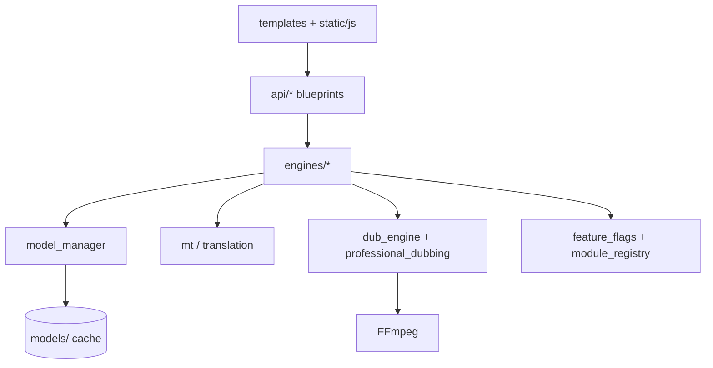

# Architecture — TubeDub V2

## Layers

## Entry points

| File | Role |
|------|------|
| `app.py` | Flask web UI (primary) |
| `desktop.py` | pywebview shell |
| `wsgi.py` | gunicorn / production WSGI |

## Core dubbing flow

1. **Prepare** — `api/prepare_api.py` → `engines/model_manager` downloads Whisper + MT models
2. **Transcribe** — faster-whisper
3. **Translate** — `engines/mt` (Marian / Argos / NLLB) + naturalizer
4. **TTS** — Edge-TTS
5. **Mux** — `engines/dub_engine.py` + timing fit / prosody

Batch orchestration: `api/auto_dub_api.py` (do not break for experiments).

## Module gating

- `data/feature_flags.json` — load order, tiers, blueprints
- `data/module_registry.json` — nav routes, release channel (stable/beta/development)
- `engines/module_registry/registry.py` — route guard + developer session

## Experimental modules (isolated)

| Module | Path | Flag |
|--------|------|------|
| Dub Studio | `engines/dub_studio/` | `dub_studio` |
| Cloud | `engines/cloud/` | `cloud_platform` |
| Platform live | `engines/live/`, `engines/streaming_studio/` | platform flags |
| Word timing | `engines/word_timing_map/` | `word_timing` |

## Data directories (runtime, gitignored)

| Path | Purpose |
|------|---------|
| `models/` | HuggingFace / Whisper weights |
| `cache/` | HF temp, pipeline cache |
| `output/` | Renders, logs, dev diagnostics |
| `uploads/` | User media uploads |
| `projects/` | Saved project JSON |

## Configuration

- `.env` — local overrides (see `.env.example`)
- `platform.env` — platform module toggles (see `platform.env.example`)
- `data/*.json` — shipped defaults; `*.local.json` for owner overrides

## Testing strategy

- **CI fast:** `tests/` via pytest (import + regression script subset)
- **Full matrix:** `scripts/test_*.py` (47 scripts)
- **E2E:** `scripts/e2e_test.py` via `run_smoke_test.bat`
