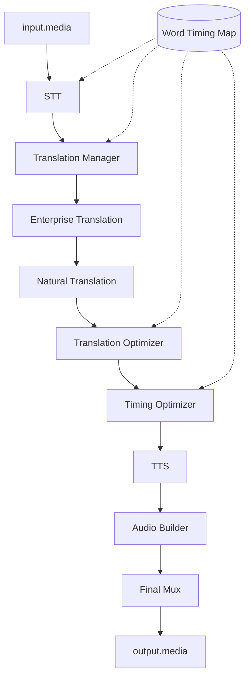
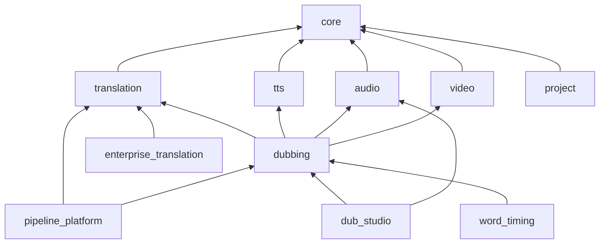

# TubeDub — Architecture Phase Complete

**Date:** 17 June 2026  
**Status:** Architecture layer complete. Functionality implementation is the next phase.

---

## 1. Directory tree (architecture layer)

```
VideoMonster_V2/
├── api/
│   ├── tubedub_platform_api.py      # Platform API (bus, projects, architecture)
│   └── pipeline_platform_api.py      # Pipeline trace API (dev)
├── data/
│   ├── tubedub_modules.json          # Module catalog (release channels)
│   ├── feature_flags.json            # Feature flags (DISABLED/DEVELOPER/RELEASE)
│   └── module_registry.json          # UI nav registry
├── docs/
│   └── ARCHITECTURE_TZ_COMPLETE.md   # This document
├── engines/
│   ├── tubedub/                      # ★ Unified platform core
│   │   ├── lifecycle.py              # initialize/load/run/stop/dispose/health_check
│   │   ├── api_bus.py                # Inter-module public API
│   │   ├── plugin_host.py            # Universal plugin host
│   │   ├── module_manager.py         # Lifecycle orchestration
│   │   ├── catalog.py                # Module catalog
│   │   ├── sync.py                   # Feature Flags ↔ Catalog sync
│   │   ├── release.py                # DISABLED | DEVELOPER | RELEASE
│   │   ├── bootstrap.py              # Single bootstrap entry
│   │   ├── adapters/base.py          # Module adapters (legacy boundary)
│   │   ├── project/
│   │   │   ├── model.py              # .tdproj unified model
│   │   │   └── store.py              # Project storage
│   │   ├── pipeline/
│   │   │   ├── __init__.py           # Unified pipeline entry
│   │   │   └── plugins.py            # Pipeline stages as plugins
│   │   └── dev_mode/
│   │       └── dashboard.py          # Developer Mode dashboard
│   ├── pipeline_platform/            # 9-stage pipeline contracts
│   │   ├── contract.py
│   │   ├── orchestrator.py
│   │   ├── registry.py
│   │   ├── stages/adapters.py
│   │   ├── timing_engine.py
│   │   ├── translation_optimizer_platform.py
│   │   └── word_timing_bridge.py
│   ├── dub_studio/                   # Dub Studio (architecture + partial impl)
│   │   ├── models.py                 # Tracks: mute/solo/vol/pan/monitor/record/plugins
│   │   ├── plugin_host.py            # → tubedub.plugin_host
│   │   └── service.py
│   ├── feature_flags/                # Feature flag manager
│   └── module_registry/              # UI module registry
├── projects/tdproj/                  # .tdproj storage root
├── templates/
│   ├── dev_architecture.html         # Architecture dashboard UI
│   └── pipeline_dev.html             # Pipeline inspector UI
└── tests/
    ├── test_tubedub_architecture.py
    └── test_pipeline_platform.py
```

---

## 2. All registered modules

| ID | Label | Release | Adapter | Dependencies |
|----|-------|---------|---------|--------------|
| core | Core Engine | RELEASE | core | — |
| translation | Translation | RELEASE | translation | core |
| tts | TTS | RELEASE | tts | core |
| audio | Audio Engine | RELEASE | audio | core |
| video | Video Engine | RELEASE | video | core |
| dubbing | Dubbing Pipeline | RELEASE | dubbing | translation, tts, audio, video |
| pipeline_platform | Pipeline Platform | DEVELOPER | pipeline_platform | translation, dubbing |
| enterprise_translation | Enterprise Translation | DEVELOPER | stub | translation |
| word_timing | Word Timing Map | DEVELOPER | stub | dubbing |
| professional_dubbing | Professional Dubbing | DEVELOPER | stub | dubbing |
| dub_studio | Dub Studio | DEVELOPER | dub_studio | dubbing, audio |
| project | Project Storage | RELEASE | project | core |
| developer_tools | Developer Tools | DEVELOPER | stub | core |
| cloud_platform | Cloud Platform | DISABLED | stub | core |
| live_translation | Live Translation | DISABLED | stub | translation, tts |

Source: `data/tubedub_modules.json`

---

## 3. Feature Flags (DISABLED / DEVELOPER / RELEASE)

Switch channel with one flag — no code change:

```
PATCH /api/tubedub/platform/features/<feature_id>/channel
Body: { "release_channel": "DISABLED" | "DEVELOPER" | "RELEASE" }
```

| Feature ID | Default channel | Tier |
|------------|-----------------|------|
| core | RELEASE | core |
| translation | RELEASE | core |
| tts | RELEASE | core |
| audio | RELEASE | core |
| video | RELEASE | core |
| dubbing | RELEASE | core |
| ui | RELEASE | core |
| enterprise_translation | DEVELOPER | pro |
| word_timing | DEVELOPER | pro |
| professional_dubbing | DEVELOPER | pro |
| pipeline_platform | DEVELOPER | developer |
| dub_studio | DEVELOPER | pro |
| developer_tools | DEVELOPER | developer |
| cloud_platform | DISABLED | developer |
| live_translation | DISABLED | experimental |

Implementation: `engines/tubedub/release.py`, `engines/feature_flags/manager.py#set_release_channel`

---

## 4. Pipeline diagram



Each stage = plugin `pipeline.<stage_id>` in PluginHost.  
Contracts: `engines/pipeline_platform/contract.py`

---

## 5. Dependency diagram



All runtime calls go through **ApiBus** — no direct cross-module imports in new code.

---

## 6. Public API per module

| Namespace | Methods | Module |
|-----------|---------|--------|
| `core` | `status`, `health` | core |
| `translation` | `status`, `health`, `translate` | translation |
| `pipeline` | `status`, `health`, `trace`, `stages` | pipeline_platform |
| `dub_studio` | `status`, `health`, `plugins` | dub_studio |
| `project` | `status`, `health`, `create`, `load`, `list` | project |
| `dubbing` | `status`, `health` | dubbing |
| `tts` | `status`, `health` | tts |
| `audio` | `status`, `health` | audio |
| `video` | `status`, `health` | video |

HTTP entry: `POST /api/tubedub/platform/bus`  
Body: `{ "namespace", "method", "payload" }`

PluginHost: `plugin_host.invoke(plugin_id, payload={})`  
Pipeline stages: `pipeline.stt`, `pipeline.translation_manager`, … `pipeline.final_mux`

---

## 7. Module lifecycle (mandatory)

Every module implements `PlatformModule`:

```python
initialize(ctx)  → ModuleContext
load()           → ready
run(payload)     → dict
stop()           → paused
dispose()        → cleanup + unregister API
health_check()   → HealthReport
```

Orchestrator: `engines/tubedub/module_manager.py`  
Bootstrap: `engines/tubedub/bootstrap.py` (called from `app.py` on startup)

---

## 8. Project model (.tdproj)

Format: `tubedub-project` v1, extension `.tdproj`

Fields: `project_id`, `title`, `src_lang`, `tgt_lang`, `modules{}`, `pipeline{}`, `assets[]`, `meta{}`

Storage: `projects/tdproj/<id>/<title>.tdproj`  
Index: `data/tdproj_index.json`  
API: `project.create`, `project.load`, `project.list` via ApiBus

---

## 9. Developer Mode

| UI | Route | API |
|----|-------|-----|
| Architecture Dashboard | `/dev/architecture` | `GET /api/tubedub/platform/architecture` |
| Pipeline Inspector | `/dev/pipeline` | `GET /api/pipeline/platform/task/<id>` |
| Feature Flags Panel | `/dev/panel` | `/api/feature-flags/*` |
| Module Manager | `/dev/modules` | `/api/modules/*` |

Dashboard shows: pipeline structure, all modules, status, errors, timing, load, logs, models, plugins, data route, copy-all.

---

## 10. Incomplete modules (architecture ready, functionality pending)

| Module | Architecture | Functionality |
|--------|-------------|---------------|
| dub_studio | ✅ tracks, plugins, API | ⬜ waveform, VST host, full record UI |
| enterprise_translation | ✅ catalog + bus stub | ⬜ full bus adapter |
| word_timing | ✅ bridge + models | ⬜ real STT alignment |
| cloud_platform | ✅ DISABLED stub | ⬜ remote jobs |
| live_translation | ✅ DISABLED stub | ⬜ realtime pipeline |
| VST/VST3 | ✅ bridge interface | ⬜ native host |
| pipeline stages TTS/Mux | ✅ trace from info | ⬜ live per-stage execution in batch dub |

---

## 11. Ready for implementation (next phase)

1. **Dub Studio UI** — wire track controls to existing PATCH API  
2. **Word Timing** — connect `alignment_engine` to STT output via plugin  
3. **Enterprise Translation** — bus adapter delegating to existing pipeline  
4. **Batch dub integration** — emit `pipeline_platform_trace` per segment during run  
5. **VST bridge** — implement `set_vst_bridge()` processor  
6. **Release promotion** — change `release_channel` to RELEASE when module tests pass  

---

## 12. Tests

```
tests/test_tubedub_architecture.py  — lifecycle, bus, tdproj, bootstrap, plugins
tests/test_pipeline_platform.py       — 9 stages, WTM, optimizer, timing
```

Run: `python -m pytest tests/test_tubedub_architecture.py tests/test_pipeline_platform.py -q`

---

## 13. Rules enforced

- ✅ Unified lifecycle on all platform modules  
- ✅ ApiBus for inter-module communication  
- ✅ PluginHost for FX + pipeline stages  
- ✅ Feature Flags: DISABLED / DEVELOPER / RELEASE  
- ✅ Legacy batch dub (`api/auto_dub_api.py`) not rewritten  
- ✅ New code connects via adapters + bus only  

**Architecture phase: COMPLETE**
