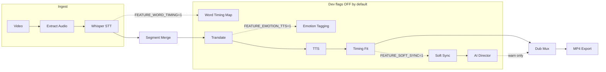

# TubeDub 2.0 Production Architecture

Документ описывает модульную архитектуру Phase 1 — foundation без изменения default pipeline при выключенных feature flags.

## Pipeline diagram



## Core modules (`engines/core/`)

| Модуль | Файл | Описание |
|--------|------|----------|
| Feature flags | `feature_flags.py` | `is_enabled()`, `is_developer()`, `is_module_visible()` |
| Module registry | `module_registry.py` | GREEN/YELLOW/RED readiness |
| Contracts | `pipeline_contracts.py` | `WordTiming`, `SegmentTiming`, `PipelineContext` |
| Events | `events.py` | In-process event bus |

## Feature flags (dev defaults OFF)

| Flag | Env | Модуль |
|------|-----|--------|
| Word Timing | `FEATURE_WORD_TIMING=1` | `engines/word_timing.py` |
| Soft Sync | `FEATURE_SOFT_SYNC=1` | `engines/soft_sync.py` |
| Emotion TTS | `FEATURE_EMOTION_TTS=1` | `engines/emotion_tagger.py` |
| AI Director | `FEATURE_AI_DIRECTOR=1` | `engines/ai_director.py` |
| Dub Studio | `FEATURE_DUB_STUDIO=1` | Timeline skeleton |
| AI Assistant | `FEATURE_AI_ASSISTANT=1` | `api/assistant_api.py` |
| User Recording | `FEATURE_USER_RECORDING=1` | `api/recording_api.py` |

Developer mode: `VM_DEV_MODE=1` или owner + 🔧 Dev в UI.

## Module readiness (GREEN / YELLOW / RED)

| Статус registry | Readiness | Пользовательский UI |
|-----------------|-----------|---------------------|
| stable | GREEN | Виден при `visible_to_users` |
| beta | YELLOW | Только при `show_beta_to_users` |
| development / disabled | RED | Только developer mode |

## API (developer)

| Endpoint | Описание |
|----------|----------|
| `GET /api/dev/pipeline/<task_id>` | Стадии, word map, director |
| `GET /api/dev/pipeline/<task_id>/report` | Текстовый отчёт AI Director |
| `GET /api/dev/modules/readiness` | Таблица GREEN/YELLOW/RED |
| `POST /api/assistant/command` | shorter, conversational, polish |
| `POST /api/recording/punch-in` | Stub (YELLOW) |
| `GET /api/studio/tracks` | Timeline track state stub |

## Plugin system

- `engines/plugins/base.py` — `AudioPlugin.process(audio, params)`
- `engines/plugins/registry.py` — EQ, Compressor pass-through stubs
- Order: `data/plugin_order.json`

## Project format `.tdproj`

- `engines/project_format.py` — JSON + zip (video ref, segments, word_timing, emotions, history)
- Расширяет `engines/tubedub/project/store.py`

## Cloud / Live (interfaces only)

- `engines/cloud/storage_interface.py` — `LocalStorage` (GREEN path), Drive/S3 stubs
- `engines/live/live_interface.py` — RED stub, adapter to `engines.live.pipeline`

## Limitations (Phase 1)

1. **Dub Studio DAW** — skeleton timeline only (RED/DEVELOPMENT), не полноценный DAW
2. **User Recording** — punch in/out API stub, без capture
3. **AI Assistant** — dev-only, без LLM chat
4. **Cloud** — local mirror only; Drive/S3 NOT_IMPLEMENTED
5. **Live** — RED; batch dub pipeline не затронут
6. **Soft Sync** — не заменяет default `timing_fit` без flag
7. **Word Timing** — без flag STT→merge→translate без persist word maps

## Tests

```bash
pytest tests/test_feature_flags.py tests/test_word_timing.py tests/test_ai_director.py -q
python -c "import app"
```
