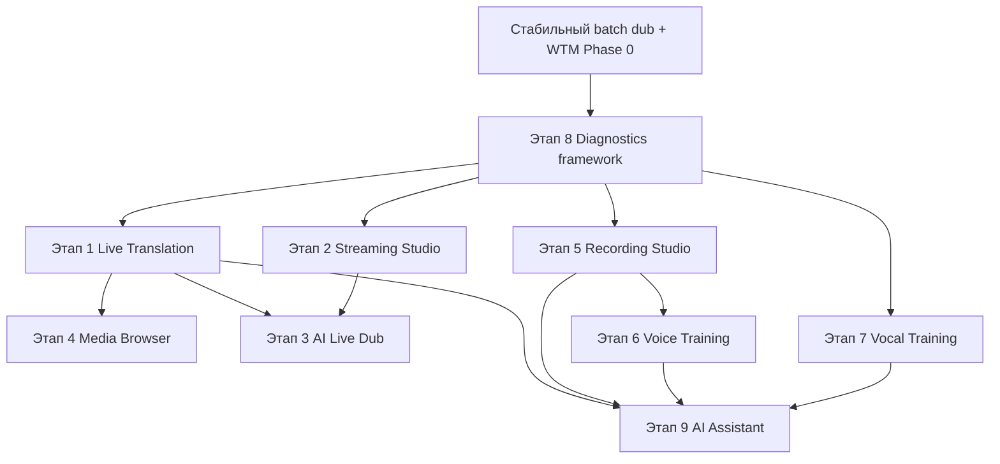

# ТЗ: Реализация платформы TubeDub как универсальной AI Media Platform

**Версия:** 1.1  
**Статус:** Implementation TZ — **скелет этапов 1–10 в коде** (2026-06-17)  
**Продукт:** TubeDub V2 (*Powered by VideoMonster Engine*)  
**Дата:** 2026-06-17  
**Приоритет:** Поэтапный (не блокирует стабильный batch dub)

**Связанные документы:** `docs/TZ_PLATFORM_ROADMAP.md` (стратегия), `docs/TZ_WORD_TIMING_MAP.md`, `docs/TZ_AI_MODEL_MANAGER_AND_DOWNLOAD_CENTER.md`

---

## Содержание

1. [Цель и главный принцип](#1-цель-и-главный-принцип)
2. [Правила реализации](#2-правила-реализации)
3. [Карта модулей и границы](#3-карта-модулей-и-границы)
4. [Этап 1 — Live Translation Engine](#4-этап-1--live-translation-engine)
5. [Этап 2 — Streaming Studio](#5-этап-2--streaming-studio)
6. [Этап 3 — AI Live Dub](#6-этап-3--ai-live-dub)
7. [Этап 4 — Media Browser](#7-этап-4--media-browser)
8. [Этап 5 — Recording Studio](#8-этап-5--recording-studio)
9. [Этап 6 — Voice Training](#9-этап-6--voice-training)
10. [Этап 7 — Vocal Training](#10-этап-7--vocal-training)
11. [Этап 8 — Developer Diagnostics](#11-этап-8--developer-diagnostics)
12. [Этап 9 — AI Assistant](#12-этап-9--ai-assistant)
13. [Этап 10 — Архитектурные требования](#13-этап-10--архитектурные-требования)
14. [Порядок внедрения и зависимости](#14-порядок-внедрения-и-зависимости)
15. [Критерии приёмки платформы](#15-критерии-приёмки-платформы)

---

## 1. Цель и главный принцип

### 1.1 Цель

**Не создавать отдельные программы.** **Не переписывать** существующие стабильные модули. **Максимально использовать** уже существующую архитектуру TubeDub, расширяя её **новыми независимыми модулями**.

TubeDub постепенно превращается из программы видеодубляжа в **универсальную AI Media Platform**, объединяющую:

- перевод и дубляж;
- live-перевод и стриминг;
- запись и монтаж;
- озвучку и синхронизацию;
- обучение дикторов и вокалу;
- работу с любым медиаконтентом (файл, URL, поток, камера, экран).

### 1.2 Главный принцип

| Правило | Смысл |
|---------|--------|
| Модульность | Каждая возможность — отдельный модуль / orchestrator |
| Не ломать batch dub | `api/auto_dub_api.py` и batch pipeline — эталон стабильности |
| OSS first | Перед своим кодом — анализ зрелых open-source решений |
| Plug-in engines | Переиспользовать контракты MT, STT, TTS, как в `engines/mt/registry.py` |
| Feature flags | Любой новый модуль можно полностью отключить |
| Dev transparency | Этап 8 обязателен для каждого нового модуля |

---

## 2. Правила реализации

### 2.1 Перед каждым этапом (обязательный gate)

1. **Research doc** — `docs/research/ETAP{N}_OSS_ANALYSIS.md`: кандидаты OSS, лицензии, активность, риски, выбор.
2. **Spike / POC** — изолированный скрипт в `scripts/spikes/`, без правок batch pipeline.
3. **Module skeleton** — каталог в `engines/`, `api/`, `tests/`, env vars, `VM_*_ENABLED=0` по умолчанию.
4. **Diagnostics hook** — интеграция с `DevDiagnostics` (§11).
5. **Regression** — smoke batch dub green на эталонном видео.

### 2.2 Приоритет open-source (не изобретать своё)

| Область | Предпочтительные OSS (анализ перед выбором) |
|---------|---------------------------------------------|
| Demux / stream / RTMP / HLS / RTSP | **FFmpeg** (libavformat) |
| URL extract | **yt-dlp** |
| Streaming STT | **faster-whisper** (CTranslate2), **Silero VAD** |
| Batch STT | существующий **Whisper** (`engines/stt_engine.py`) |
| TTS | **edge-tts** (есть), опционально **Piper**, **Coqui** |
| Audio I/O | **sounddevice** / **PyAudio** |
| Screen capture | **FFmpeg** (gdigrab/dshow/x11grab), **mss** (screenshots) |
| Webcam | **FFmpeg** / **OpenCV** |
| RTMP publish | **FFmpeg** flv/rtmp |
| Noise reduction | **RNNoise**, **DeepFilterNet**, **noisereduce** |
| FX chain | **pedalboard** (Spotify), **pyloudnorm** |
| Pitch / rhythm | **librosa**, **aubio**, **CREPE** / **torchcrepe** |
| Player (UI) | **hls.js** / **video.js** + WebVTT |
| Streaming server (optional) | **MediaMTX** (rtsp/webrtc relay) |

Собственный код — только **оркестрация**, **адаптеры**, **TubeDub-специфичная** логика (translation router, entity polish, trace).

### 2.3 Что переиспользовать из TubeDub (не дублировать)

| Компонент | Путь | Использование в live / новых модулях |
|-----------|------|--------------------------------------|
| Translation Manager | `engines/translation_manager.py` | Маршрутизация MT |
| Translation Pipeline | `engines/translation_pipeline.py` | Batch; live — **fast lane** wrapper |
| Naturalizer V2 | `engines/naturalizer_v2/` | Batch full; live — `light=1` или skip |
| Enterprise Translation | `engines/enterprise_translation/` | Опционально для quality live segments |
| TTS | `engines/tts.py`, `engines/tts_engines/` | Chunked streaming adapter |
| Professional dubbing / mix | `engines/professional_dubbing/`, `engines/dub_engine.py` | Ducking, prosody |
| Word Timing Map | `engines/word_timing_map/` | Live approximate timing |
| Model Manager | `engines/model_manager/` | Profiles: `live`, `dub_quality`, `coach` |
| Broadcast gate | `engines/broadcast/` | Quality gate для MT в live |
| Dev diagnostics | `engines/dev_diagnostics.py` | Расширение секций |
| Translation trace | `engines/translation_trace.py` | Паттерн для live trace |

---

## 3. Карта модулей и границы

### 3.1 Целевая структура (новые каталоги)

```
engines/
  live/                    # Этап 1, 3 — Live Translation / AI Live Dub
    ingest/                # URL, HLS, RTSP, file adapters
    pipeline.py            # ring buffer → STT → MT → TTS → play
    stt_stream.py          # streaming STT adapter (faster-whisper)
    phrase_queue.py        # phrase segmentation + context window
    playback.py            # sync playback + subtitle emit
    config.py
  streaming_studio/        # Этап 2 — capture + stream out
    capture/
    publisher/             # RTMP
    session.py
  media_browser/           # Этап 4 — UI backend (thin)
  recording_studio/        # Этап 5 — multitrack + FX
    fx/                    # pedalboard / rnnoise wrappers
  voice_training/          # Этап 6
  vocal_training/          # Этап 7
  platform_diagnostics/    # Этап 8 — unified trace (extends dev_diagnostics)
  ai_assistant/            # Этап 9
api/
  live_api.py              # SSE/WebSocket
  streaming_api.py
  media_browser_api.py
  recording_api.py
  coach_api.py
studios/                   # UI routes (future): live, record, browser, coach
scripts/
  spikes/                  # POC per etap
  test_live_*.py           # per-module tests
docs/
  research/                # OSS analysis per etap
```

### 3.2 Запретные зоны (не переписывать)

- `api/auto_dub_api.py` — только **тонкие hooks** (shared utils), не live logic inside.
- `engines/translation_pipeline.py` — не менять batch path; live вызывает через **отдельный** `LiveTranslationPipeline` class.
- `engines/stt_engine.py` — batch Whisper; live использует **`engines/live/stt_stream.py`** (может импортировать общие utils).
- `engines/timing_fit.py`, SSO core — batch only unless explicit WTM live phase.

### 3.3 Master feature flags

| Variable | Default | Module |
|----------|---------|--------|
| `VM_LIVE_TRANSLATION_ENABLED` | `0` | Этап 1 |
| `VM_STREAMING_STUDIO_ENABLED` | `0` | Этап 2 |
| `VM_AI_LIVE_DUB_ENABLED` | `0` | Этап 3 |
| `VM_MEDIA_BROWSER_ENABLED` | `0` | Этап 4 |
| `VM_RECORDING_STUDIO_ENABLED` | `0` | Этап 5 |
| `VM_VOICE_TRAINING_ENABLED` | `0` | Этап 6 |
| `VM_VOCAL_TRAINING_ENABLED` | `0` | Этап 7 |
| `VM_PLATFORM_DIAGNOSTICS` | `1` | Этап 8 (dev) |
| `VM_AI_ASSISTANT_ENABLED` | `0` | Этап 9 |

---

## 4. Этап 1 — Live Translation Engine

### 4.1 Назначение

**Отдельный модуль**, работающий **независимо** от batch видеодубляжа.

Пользователь: ссылка или поток → выбор языка → просмотр с AI-переводом и субтитрами **без** предварительного полного скачивания и batch-ожидания.

### 4.2 Поддерживаемые источники

| Источник | Adapter | OSS |
|----------|---------|-----|
| YouTube, TikTok, Vimeo, … | `YtDlpIngest` | yt-dlp |
| Twitch live/VOD | `HlsIngest` | yt-dlp + FFmpeg |
| Локальный файл | `FileIngest` | FFmpeg (есть) |
| HLS / DASH | `HlsIngest` | FFmpeg |
| RTSP | `RtspIngest` | FFmpeg |
| Podcast / audio URL | `AudioIngest` | FFmpeg |
| Webinar (HTTP stream) | `HttpIngest` | FFmpeg |

При DRM / geo / ToS — **явная ошибка** в UI, без silent fail.

### 4.3 Алгоритм (потоковая обработка)

```
получение видеопотока (ingest)
        ↓
получение аудиопотока (demux → PCM ring buffer)
        ↓
непрерывный STT (faster-whisper + VAD, partial + final)
        ↓
Translation Manager (engines/translation_manager.py)
        ↓
Natural Translation (naturalizer light / apply_style_polish fast)
        ↓
Enterprise Translation (optional, VM_LIVE_ENTERPRISE=1, broadcast gate)
        ↓
TTS (chunked edge-tts queue)
        ↓
синхронное воспроизведение (playback delay buffer + ducking)
        ↓
переведённые субтитры (WebVTT / SSE events)
```

### 4.4 Архитектура классов

```python
# engines/live/pipeline.py (контракт)
class LiveTranslationPipeline:
    def start(self, source: LiveSource, *, tgt_lang: str, src_lang: str | None) -> str: ...
    def stop(self, session_id: str) -> None: ...
    def subscribe(self, session_id: str) -> Iterator[LiveEvent]: ...  # SSE/WS

# LiveEvent: partial_stt | final_phrase | translated | tts_ready | subtitle | error | metrics
```

**Компоненты:**

| Компонент | Файл | Ответственность |
|-----------|------|-----------------|
| Ingest | `engines/live/ingest/*.py` | URL → readable stream |
| AudioRingBuffer | `engines/live/buffer.py` | 30–120 s rolling PCM |
| StreamingSTT | `engines/live/stt_stream.py` | partial/final transcripts |
| PhraseSegmenter | `engines/live/phrase_queue.py` | VAD boundaries + min/max phrase len |
| LiveTranslator | `engines/live/translate.py` | Manager + light polish + optional enterprise |
| LiveTTS | `engines/live/tts_queue.py` | async chunk synthesis |
| LivePlayback | `engines/live/playback.py` | A/V sync, ducking |
| SubtitleEmitter | `engines/live/subtitles.py` | WebVTT cues |

### 4.5 Latency и degradation

- Целевая задержка: **3–8 с** (median).
- `VM_LIVE_LATENCY_TARGET_MS` (default `5000`).
- Degradation order: extend buffer → subtitles only → faster STT model → skip enterprise → skip naturalizer.

### 4.6 API

- `POST /api/live/start` — `{ "url"|"path", "tgt_lang", "src_lang"? }`
- `GET /api/live/stream/<session_id>` — SSE (как `api/prepare_api.py`)
- `POST /api/live/stop/<session_id>`
- `GET /api/live/diagnostics/<session_id>` — full trace (Этап 8)

### 4.7 Тесты

- `scripts/test_live_ingest.py` — file + mock HLS
- `scripts/test_live_pipeline_mock.py` — STT/TTS mocked, end-to-end events
- Integration: 30 s sample URL (CI optional, network)

### 4.8 Критерии приёмки Этапа 1

- [ ] Batch dub regression green при `VM_LIVE_TRANSLATION_ENABLED=0`
- [ ] Local file → player с переводом и субтитрами
- [ ] YouTube VOD URL → воспроизведение без ручного download пользователем
- [ ] Full trace в `output/dev/live/live_{session_id}.json`
- [ ] Модуль полностью отключается одним env flag

---

## 5. Этап 2 — Streaming Studio

### 5.1 Назначение

Полноценная **студия записи** с возможностью **одновременной** записи и **прямой трансляции**.

### 5.2 Функции

| Функция | OSS-кандидат |
|---------|--------------|
| Запись экрана | FFmpeg gdigrab / dshow / x11grab |
| Запись окна | FFmpeg + crop / Windows Graphics Capture (spike) |
| Веб-камера | FFmpeg dshow / avfoundation / v4l2 |
| Несколько микрофонов | sounddevice multi-input |
| Системный звук | WASAPI loopback (FFmpeg dshow), PulseAudio monitor |
| Многодорожечность | отдельные файлы/track buffers → timeline |
| RTMP stream out | FFmpeg `-f flv rtmp://...` |

### 5.3 Архитектура

```
StreamingSession
  ├── CaptureGraph (screen | window | cam | mic[] | system_audio)
  ├── Recorder (multitrack writer → WAV/MP4 segments)
  ├── StreamPublisher (optional RTMP)
  └── LiveBridge (optional → LiveTranslationPipeline for translated stream)
```

### 5.4 Одновременно: запись + эфир

- Один **CaptureGraph** fan-out:
  - → `Recorder` (disk)
  - → `StreamPublisher` (RTMP)
  - → optional `LiveBridge` (Этап 3)

### 5.5 API / UI

- `POST /api/streaming/session/start`
- `POST /api/streaming/session/stop`
- Tracks metadata в session JSON

### 5.6 Критерии приёмки Этапа 2

- [ ] Screen + mic 5 min record без crash
- [ ] 2 mic → 2 separate tracks
- [ ] RTMP to test server (e.g. local MediaMTX) 10 min stable
- [ ] `VM_STREAMING_STUDIO_ENABLED=0` — zero impact on dub

---

## 6. Этап 3 — AI Live Dub

### 6.1 Назначение

**Отдельный поток обработки** для стримера: речь ведущего → перевод → **новый голос** → зрители слышат перевод **с минимальной задержкой**.

Отличие от Этапа 1: фокус на **исходящем broadcast mix**, не на local watch; приоритет — минимальный latency.

### 6.2 Pipeline

```
mic / program audio (from Streaming Studio)
        ↓
streaming STT (minimal chunk size)
        ↓
fast MT (+ 2-phrase context)
        ↓
TTS (expressive / low-latency profile)
        ↓
optional voice conversion (future, consent-based)
        ↓
mix → RTMP output track (replace or second audio track)
```

### 6.3 Модуль

- `engines/live/broadcast_dub.py` — orchestrator
- Зависит от: Этап 1 (STT/TTS queue), Этап 2 (capture/publisher)
- Env: `VM_AI_LIVE_DUB_ENABLED`, `VM_LIVE_DUB_REPLACE_AUDIO=1`

### 6.4 AI-голос вместо оригинала (перспектива)

- Отдельное compliance-TZ (согласие стримера).
- OSS spike: RVC / open-voice (только после legal review).
- MVP: **TTS translation track** без voice clone.

### 6.5 Критерии приёмки Этапа 3

- [ ] Mic → RTMP with translated audio track
- [ ] Median end-to-end latency ≤ 10 s on reference HW
- [ ] Degradation: passthrough original if pipeline overload
- [ ] Trace includes per-chunk STT/MT/TTS ms

---

## 7. Этап 4 — Media Browser

### 7.1 Назначение

Отдельный **раздел UI**: открыть ссылку → просмотр → сразу AI-перевод → опционально запись / сохранение.

### 7.2 UX flow

```
открыть ссылку
        ↓
просмотр видео (player)
        ↓
кнопка «AI-перевод» → LiveTranslationPipeline (Этап 1)
        ↓
опционально: записать сессию (Этап 2)
        ↓
опционально: сохранить (clip / full session export)
```

### 7.3 Реализация

- **Thin layer:** `studios/media_browser/` + `api/media_browser_api.py`
- Не дублировать live engine — только UI + session glue
- Player: hls.js / video.js в `templates/media_browser.html`
- History: recent URLs в local storage / `data/browser_history.json`

### 7.4 Критерии приёмки Этапа 4

- [ ] Paste URL → play → toggle translation
- [ ] Subtitles overlay
- [ ] «Save segment» exports MP4 or audio+subs
- [ ] Works with Этап 1 disabled → graceful «feature off»

---

## 8. Этап 5 — Recording Studio

### 8.1 Назначение

Полноценная **студия записи** внутри TubeDub — без Audacity/Reaper для базовых задач.

### 8.2 Функции и OSS

| Функция | OSS |
|---------|-----|
| Шумоподавление | RNNoise, DeepFilterNet, noisereduce |
| Компрессор | pedalboard Compressor |
| Лимитер | pedalboard Limiter |
| EQ | pedalboard Highpass/LowShelf/… |
| Очистка речи | DeepFilterNet + RNNoise chain |
| Нормализация | pyloudnorm, ffmpeg-normalize |
| Многодорожечность | pydub / raw WAV tracks + timeline JSON |
| Несколько микрофонов | sounddevice |

### 8.3 Архитектура

```
RecordingStudioSession
  ├── Track[] (audio / mic / import)
  ├── FxChain per track (pedalboard graph)
  ├── Timeline (clips, trim, fade)
  └── Export (WAV stems, MP3, mux to video via FFmpeg)
```

### 8.4 Связь с Dub

- Import TTS reference from batch dub project
- Record voice-over per segment (WTM / segment list as cue sheet)
- Replace TTS track in export

### 8.5 Критерии приёмки Этапа 5

- [ ] Apply NR + comp + limit + normalize preset to WAV
- [ ] 2 mics → 2 tracks → stem export
- [ ] Non-destructive FX preview
- [ ] `scripts/test_recording_studio_fx.py`

---

## 9. Этап 6 — Voice Training

### 9.1 Назначение

Отдельный раздел: пользователь **читает текст** → анализ → **рекомендации**.

### 9.2 Метрики

| Метрика | Метод (OSS / existing) |
|---------|------------------------|
| Дикция / произношение | STT vs script (Whisper + diff) |
| Темп / скорость | words/min from WTM or STT timestamps |
| Дыхание | pause detection (librosa / energy threshold) |
| Ударения | language-specific rules + optional stress dict |
| Интонация | F0 contour (librosa pyin) |
| Эмоциональность | energy + pitch variance |
| Паузы | silence segments |

### 9.3 Модуль

```
engines/voice_training/
  analyzer.py      # metrics aggregation
  feedback.py      # rule-based + optional LLM tips
  session.py       # fragment progression
  config.py
```

Переиспользование: `engines/word_timing_map/`, `engines/language_intelligence/`, `engines/professional_dubbing/prosody.py`.

### 9.4 UX

- Текст фрагмента → запись → score card → tips → next fragment

### 9.5 Критерии приёмки Этапа 6

- [ ] ≥ 5 metrics per recording
- [ ] Textual recommendations (RU/UK/EN)
- [ ] Dev trace: raw audio metrics JSON
- [ ] `scripts/test_voice_training_analyzer.py`

---

## 10. Этап 7 — Vocal Training

### 10.1 Назначение

AI-преподаватель: **караоке-режим**, пользователь поёт → анализ → прогресс по фрагментам.

### 10.2 Метрики

| Метрика | OSS |
|---------|-----|
| Попадание в ноты | librosa pyin / CREPE → cents offset |
| Длительность нот | onset/offset |
| Ритм | aubio tempo/onset vs backing |
| Дыхание | pause / breath detection |
| Интонация | F0 shape correlation |
| Диапазон | min/max F0 session |
| Стабильность | pitch jitter |

### 10.3 Karaoke mode

- Backing track + lyrics timeline (LRC or custom JSON)
- Real-time pitch display (≤ 200 ms UI update target)
- Segment unlock on score threshold

### 10.4 OSS spike candidates

- **librosa** + **aubio** (core)
- **torchcrepe** (accuracy vs CPU cost — profile in ModelManager)
- **madmom** (beats — evaluate maintenance status in research doc)

### 10.5 Критерии приёмки Этапа 7

- [ ] Karaoke fragment with live pitch meter
- [ ] Post-take score report
- [ ] Progressive segments
- [ ] `scripts/test_vocal_training_pitch.py`

---

## 11. Этап 8 — Developer Diagnostics

### 11.1 Требование (сквозное для этапов 1–7)

**Никакой скрытой обработки.** Весь путь доступен для просмотра.

Каждый новый модуль обязан логировать:

```
входные данные
        ↓
результат
        ↓
время выполнения
        ↓
ошибки
        ↓
качество (score)
        ↓
использованный движок
        ↓
причина выбора (router reason)
```

### 11.2 Реализация

Расширить паттерн `engines/dev_diagnostics.py` + `engines/translation_trace.py`:

```
engines/platform_diagnostics/
  trace.py           # PlatformTraceRecord dataclass
  sink.py            # output/dev/{module}/{session_id}.json
  stages.py          # standard stage names per module
```

**Новые секции DevDiagnostics:**

`live`, `streaming`, `broadcast_dub`, `media_browser`, `recording_studio`, `voice_training`, `vocal_training`, `assistant`

### 11.3 Формат записи (единый)

```json
{
  "stage": "live.stt.partial",
  "ts_ms": 1710000000123,
  "session_id": "abc",
  "input_preview": "...",
  "output_preview": "...",
  "duration_ms": 142,
  "engine": "faster-whisper-tiny",
  "router_reason": "profile=live latency=low",
  "quality_score": 0.91,
  "error": null,
  "meta": {}
}
```

### 11.4 UI (dev only)

- Owner / dev flag: просмотр trace как Translation Review
- `GET /api/dev/trace/<module>/<session_id>`

### 11.5 Критерии приёмки Этапа 8

- [ ] Каждый модуль 1–7 пишет trace при `VM_PLATFORM_DIAGNOSTICS=1`
- [ ] Zero trace overhead when `VM_PLATFORM_DIAGNOSTICS=0` (no-op sink)
- [ ] `scripts/test_platform_diagnostics.py`

---

## 12. Этап 9 — AI Assistant

### 12.1 Назначение

Встроенный помощник анализирует все студии и объясняет проблемы:

- **где** — stage / segment / timestamp
- **почему** — router reason, quality gate
- **что произошло** — input/output diff
- **что исправить** — actionable suggestion

### 12.2 Области анализа

| Область | Источник данных |
|---------|-----------------|
| Перевод | translation_trace, quality_score |
| Дубляж / sync | WTM checkpoints, timing_map, SSO diff |
| Голос / TTS | tts logs, duration mismatch |
| Запись | recording_studio levels, clipping |
| Монтаж | timeline gaps |
| Музыка / вокал | vocal_training metrics |
| Стрим | live trace, dropped chunks |

### 12.3 Архитектура

```
engines/ai_assistant/
  collectors/     # read traces per module
  rules.py        # deterministic issues (v1)
  explainer.py    # optional LLM layer (v2)
  api.py
```

**Принцип v1:** rule-based on traces (без LLM) — быстро, воспроизводимо.

### 12.4 Критерии приёмки Этапа 9

- [ ] Given translation_trace with uk_calque → assistant message with fix hint
- [ ] Given live dropped TTS → explains backlog + suggests wider buffer
- [ ] Does not auto-modify user content without confirm
- [ ] `VM_AI_ASSISTANT_ENABLED=0` — panel hidden

---

## 13. Этап 10 — Архитектурные требования

### 13.1 Запреты

1. **Запрещается переписывать** стабильные части batch dub pipeline.
2. **Запрещается** встраивать live logic в `auto_dub_api.py` beyond shared utilities.
3. **Запрещается** добавлять hard dependency новых модулей в batch path.
4. **Запрещается** ship без feature flag и без diagnostics (Этап 8).

### 13.2 Каждый модуль обязан иметь

| Артефакт | Путь |
|----------|------|
| Собственные тесты | `scripts/test_{module}_*.py` |
| Собственная диагностика | `engines/platform_diagnostics/` + `output/dev/{module}/` |
| Полное отключение | `VM_{MODULE}_ENABLED=0` |
| Независимая конфигурация | `engines/{module}/config.py` |
| OSS research | `docs/research/ETAP{N}_OSS_ANALYSIS.md` |

### 13.3 Модульная архитектура (контракты)

Все adapters реализуют narrow interfaces:

```python
class IngestAdapter(Protocol):
    def open(self, uri: str) -> MediaStream: ...
    def close(self) -> None: ...

class StreamingSTTAdapter(Protocol):
    def feed(self, pcm: bytes) -> list[SttEvent]: ...

class LiveMTAdapter(Protocol):
    def translate_phrase(self, text: str, *, context: list[str]) -> MtResult: ...
```

Регистрация — по аналогии с `engines/mt/registry.py`, `engines/tts_engines/registry.py`.

### 13.4 ModelManager profiles

| Profile | Models |
|---------|--------|
| `dub_quality` | Whisper medium/large, full MT, full naturalizer |
| `live` | faster-whisper tiny/base, fast MT, light polish |
| `coach` | Whisper base, analysis models |
| `recording` | RNNoise, no large STT |

Скачивание **только** нужного profile при входе в студию.

---

## 14. Порядок внедрения и зависимости



**Рекомендуемый порядок:**

1. Этап 8 (framework) — параллельно с P0
2. Этап 1 → Этап 4 (user-visible live watch)
3. Этап 2 → Этап 3 (stream + broadcast dub)
4. Этап 5 → Этап 6
5. Этап 7
6. Этап 9 (после накопления traces)

---

## 15. Критерии приёмки платформы

### 15.1 Стабильность (всегда)

- Batch dub на эталонном видео: **без регрессий** при любых новых flags=0.
- Все новые модули: **off by default**.

### 15.2 Минимальный MVP платформы (этапы 1 + 4 + 8)

- URL → Media Browser → Live Translation → subtitles + dubbed audio
- Full diagnostic trace export
- OSS research docs для ingest, STT, player

### 15.3 Полный цикл (этапы 1–7 + 9)

- Watch live translated stream
- Record + broadcast translated audio
- Record voice in Recording Studio
- Train speech and vocal in coach studios
- Assistant explains issues from traces

### 15.4 Документация

- [ ] `docs/TZ_AI_MEDIA_PLATFORM.md` (этот документ)
- [ ] `docs/TZ_PLATFORM_ROADMAP.md` (стратегия)
- [ ] `docs/research/ETAP1_OSS_ANALYSIS.md` … per etap before coding

---

*При старте Этапа 1 первым deliverable является `docs/research/ETAP1_OSS_ANALYSIS.md` + spike `scripts/spikes/live_ingest_poc.py` — без изменений batch pipeline.*

---

## Appendix A — Реализовано в коде (v1.1)

| Этап | Каталог / API | Примечание |
|------|---------------|------------|
| 1 | `engines/live/`, `/api/platform/live/*` | Chunk pipeline для файлов; URL через yt-dlp |
| 2 | `engines/streaming_studio/` | FFmpeg mic record + RTMP stub |
| 3 | `engines/live/broadcast_dub.py` | Bridge к Live pipeline |
| 4 | `engines/media_browser/`, UI `/platform` | Media Browser + SSE |
| 5 | `engines/recording_studio/` | FX chain (optional pedalboard/RNNoise) |
| 6 | `engines/voice_training/` | STT + tempo + script match |
| 7 | `engines/vocal_training/` | Pitch (librosa optional) |
| 8 | `engines/platform_diagnostics/` | JSON traces `output/dev/{module}/` |
| 9 | `engines/ai_assistant/` | Rule-based trace + review hints |
| 10 | `engines/platform/config.py` | Feature flags, `VM_PLATFORM_ENABLED` |

**Тесты:** `scripts/test_platform_modules.py`  
**Включение:** скопировать `platform.env.example` → переменные окружения или `VM_PLATFORM_ENABLED=1`
